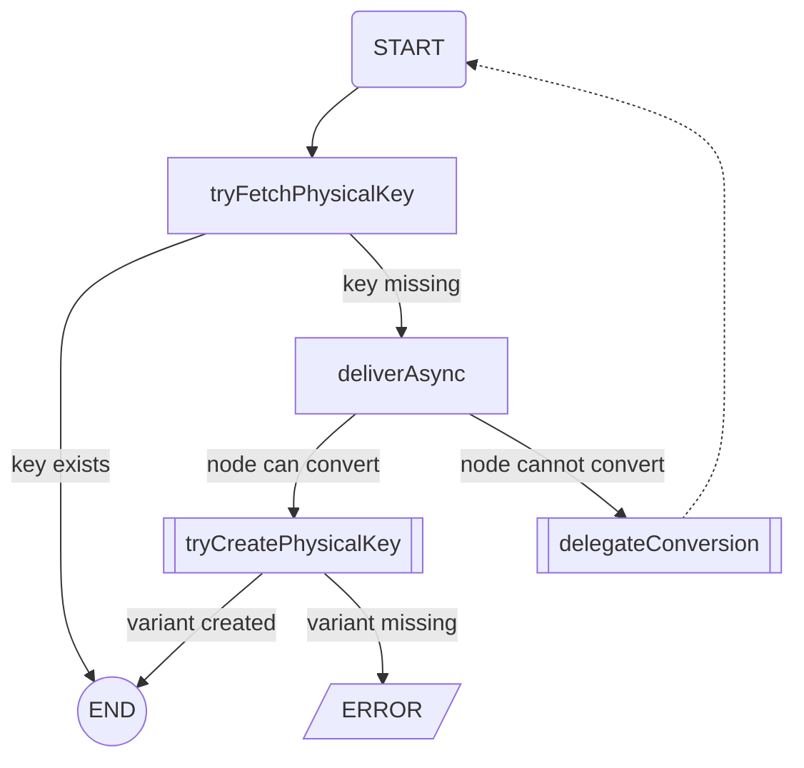
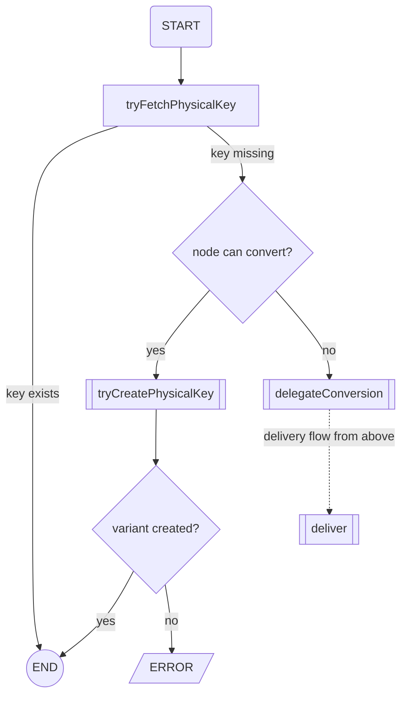
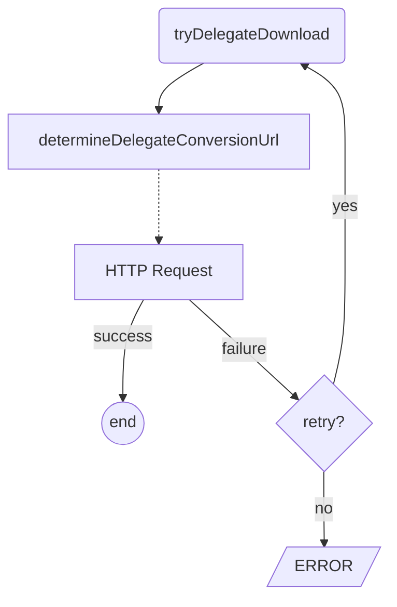
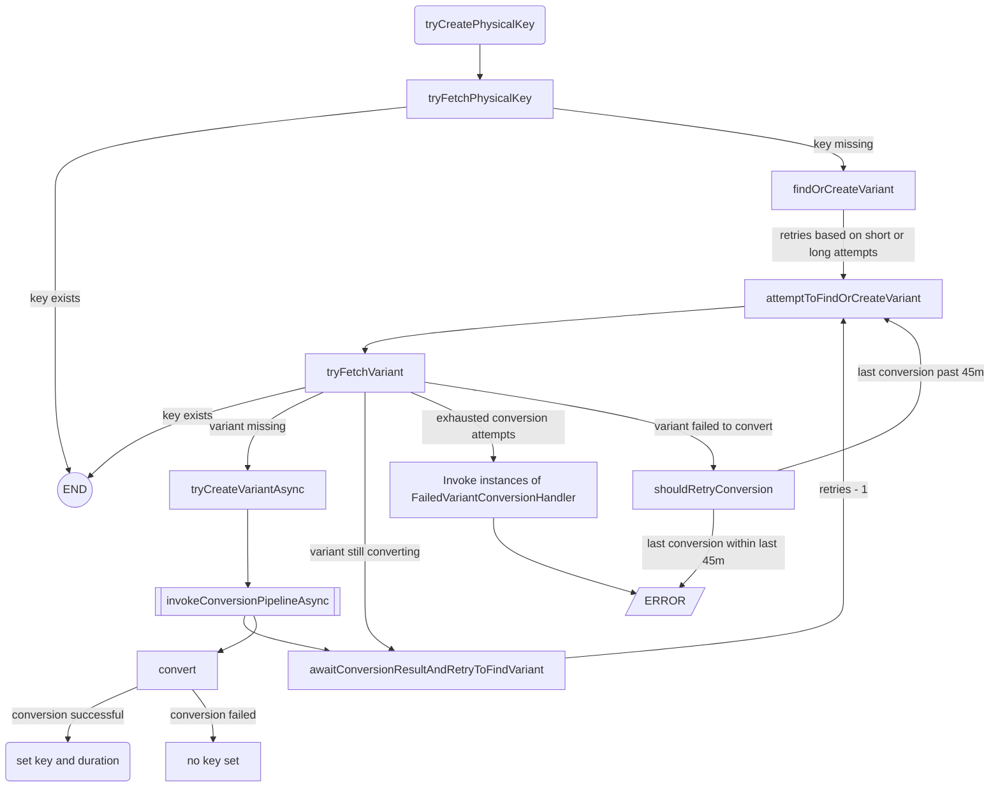

# Layer 2 - Blob Storage

This is the **layer 2** of the [Storage Framework](../). It permits to store [blobs](Blob.java) and
even [directories](Directory.java). The metadata is either stored in a **JDBC datasource** or **MongoDB**.
The actual binary data is stored by the [layer 1](../layer1/).

To use a  **JDBC datasource** as storage engine the framework **biz.storage-blob-jdbc** must be enabled.
When using **MongoDB** the name of the framework to enable is **biz.storage-blob-mongo**.

The main entry point is [BlobStorage](layer2/BlobStorage.java) which provides access to the individual
[BlobStorageSpaces](layer2/BlobStorageSpace.java).

However, most probably this framework or layer will be accessed via three other central parts.
The first are direct references from entities to blobs. This is supported via either a [BlobHardRef](BlobHardRef.java)
or a [BlobSoftRef](BlobSoftRef.java). Where the former lets a user pick an existing object and associate
it with an entity and the latter is used to directly upload a file to be associated. This file will not be
visible outside of this reference and also deleted along with the entity.

If an entity references many files a [BlobContainer](BlobContainer.java) can be used to associate any number
of blobs to an entity. As when using a **BlobHardRef** these blobs aren't visible anywhere else and will be
automatically deleted once the entity is deleted.

The third way to access the blobs and directories is by setting the **browsable** flag of a storage space
(in the system configuration). This will be picked up by the [L3Uplink](L3Uplink.java) and thus make the
blobs and directories visible as a virtual file system.

A notable example of this pattern is the **work** space which is enabled by default and used by jobs to
import data from and export data to.

Blobs can also be served via HTTP bei using the [URLBuilder](URLBuilder.java) which most probably
generates an URL served by the [BlobDispatcher](BlobDispatcher.java). Next to serving the raw data,
the framework permits to generate [variants](variants/BlobVariant.java) on demand via one or more
[converters](variants/Converter.java). Typical example for a variant are various image sizes or preview images from
videos.
These converters are configured via the system configuration
and managed by the [ConversionEngine](variants/ConversionEngine.java).

## Physical vs Virtual

In our framework we often use the term *physical* to represent a real file (raw or variant). Delivering these
files is easy we already know exactly which file to serve as a physical object ID is present.

The term *virtual* means we are requesting a variant, and we do not know if it exists yet. In this case a quite
complex process takes place in order to trigger a conversion, which must cope with parallel requests coming from
various nodes in the cluster and even the conversion itself, which can be delegated to dedicated nodes.

## Virtual Delivery

A virtual delivery means that a file is being requested via a `/dasd/` served by
our [BlobDispatcher](BlobDispatcher.java).

The following diagram displays the main flow of the virtual delivery process:

## Virtual Download

A virtual download means that a file is being requested via an API call to the [BlobStorage](layer2/BlobStorage.java).

The following diagram displays the main flow of the virtual download process:

## Delegation

Delegation simply means that the current node is not configured to convert variants and all it does is to pick
a random conversion node from a predefined list and delegate the conversion to it by invoking the very same `/dasd/` URL
on it, causing the very same entry point to happen, just in a different node.

The creation is centrally controlled in the database as the physical object key will be written to the database.

## Creation

The creation involves 2 steps: creating the variant in the database and triggering the conversion.

A variant might also exist in the database and a conversion is taking place `Variant.queuedForConversion = true` or the
last conversion failed, which attempts are stored in `Variant.conversionAttempts`.

For the creation of the variant in the database the `maxOptimisticLockAttempts` setting is used as this process concurs
with other threads in the same node as well as other nodes trying to create the same variant.

Once a creation actually starts, the `maxConversionAttempts`, `maxLongConversionAttempts` and `conversionRetryDelay` is
used to wait for the conversion to finish. We provide an option for callers to wait longer for a conversion to finish,
thus having 2 settings.

This diagram displays the main flow of the creation process and retry mechanisms:

